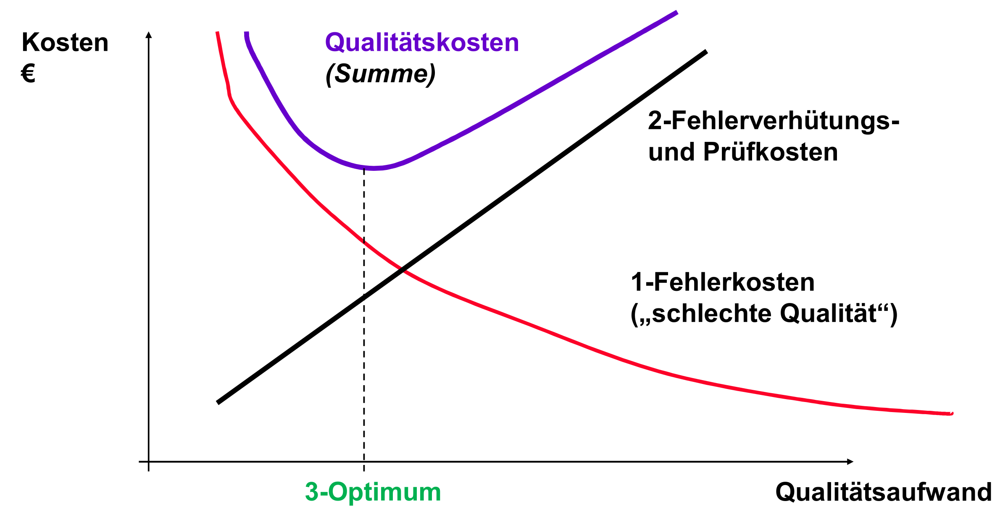

# AKV
>Aufgaben-Kompetenzen-Verantwortlichkeiten

## Projektleiter/in
- Aufgaben:
    - Plant Projekt
    - Kontrolliert Durchführung
    - Berichtet Lenkungsausschuss
- Kompetenzen:
    - Kann MA aus Linie einfordern
    - Kann MA Aufgaben zuweisen
- Verantwortung
    - Termin- u. Budgetkontrolle
    - Risikoüberwachung

## Qualitätsbeauftragte/r
- Aufgaben:
    - Plant Q-Maßnahmen im Projekt
    - Erinnert an geplante Maßnahmen
    - Fordert deren Ergebnisse ein
- Kompetenzen:
    - Kann Nacharbeit verlangen auch gegen PL-Votum
    - Kann an Lenkungsausschuss eskalieren
- Verantwortung:
    - Weist PL auf Q-Probleme hin
    - Berichtet Q-Leiter rechtzeitig
    - Stimmt Q-Aufwände mit PL ab

# Begriffe und Definitionen
Qualitätsmanagement-System (DIN EN ISO 8402)
: Alle Tätigkeiten der Gesamtführungsaufgabe, welche die Qualitätspolitik, Ziele und Verantwortlichkeiten festlegen, sowie diese durch Mittel wie Qualitätsplanung, -lenkung, -sicherung und -verbesserung im Rahmen des Qualitätsmanagementsystems (QMS) verwirklichen.

Qualitätssicherung (QS)
: Maßnahmen um SW-Qualität *im* Projekt

Qualitätsmanagement (QM)
: SW-Qualität *über Projekt hinaus*

Qualitätsbeauftragte
: achtet darauf, dass QS- und QM-Maßnahmen durchgeführt werden, unterstützt die Durchführung der Maßnahmen

# Dienstleistungen für Qualität
>was leistet die Qualitäts-Organisation im Unternehmen?
- Für die Software-Entwicklung
    - Vertragsprüfung (Papier!)
    - Entwicklungsplanung und –verfahren, Quality Gates
    - Validierungs- und Verifikationsverfahren
    - Wartung
    - Konfigurationsmanagement (konstruktiv)
    - Risikomanagement vorbereiten, evtl. unterstützen
- Dokumentenlenkung
- Qualitätsaufzeichnungen (aus Prüfungen, analytisch)
    - Review-, Test-, QMS-Auditberichte aufbewahren
    - Auswerten, um QMS-Wirkung zu belegen
    - Ins Konfigurationsmanagement einbeziehen (Bezug zu SW)
- Messungen, Analysen auf Basis von Qualitätsaufzeichnungen
- Methoden und Werkzeuge (Test etc.) bereitstellen, schulen
- Beschaffung: Auftragnehmermanagement
- Beistellungen: Auftraggebermanagement
- Schulungen (konstruktiv) und Erfahrungsaustausch

# Grundsätze der Qualitätsverantwortung
1. Wer für ein (SW-) Produkt verantwortlich ist, ist damit auch untrennbar für dessen Qualität verantwortlich d.h. der Verantwortung für Sachziele, Kosten, Termine
2. Jeder Mitarbeiter ist im eigenen Arbeitsbereich persönlich verantwortlich für die Qualität der eigenen Arbeit
3. Qualitätsfachleute (QB) sind verantwortlich für richtig erbrachte Dienstleistungen um SW-Qualität (Prüfungen, QS-Maßnahmen etc.). Sie sind nicht verantwortlich für die Qualität der erstellten Software

# Kosten/Nutzen-Abwägung von SW-Qualitätsanstrengungen
1. Wie entwickeln sich Fehlerkosten mit dem Qualitätsaufwand?
2. Wie steigen Fehlerverhütungskosten mit dem Qualitätsaufwand?
3. Wieviel Aufwand sollte man treiben?

# TQM

Total Quality Management
: Ganzheitliche Managementmethode einer Organisation, die Qualität in den Mittelpunkt stellt und durch Zufriedenstellen der Kunden auf langfristigen Geschäftserfolg sowie auf Nutzen für die Mitglieder der Organisation und für die Gesellschaft zielt.“ (DIN EN ISO 8402)