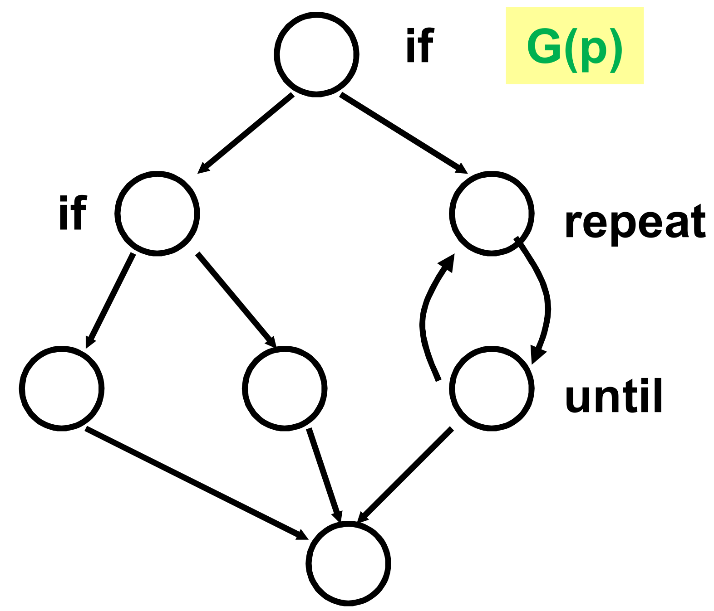
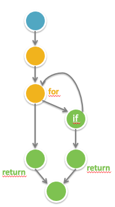

Die Idee der McCabe Metrik, ist dass der Programmablauf (Programmverzweigungen und Schleifen) das Programm komplex machen, nicht zwingend die LOC. Egal ob man durch Programmcode oder Ablaufgraph misst, sollten beide Techniken immer das gleiche Ergebnis liefern.

# Gemessen an Programmcode

Formel für Metrik \(m_c\), am Code \(c\) eines Prog. \(P\) gemessen

\[
m_c(p) := \# \text{IFs} + \# \text{LOOPs} + \# \text{CASEs} +1
\]

## Beispiel 1 (Vorlesung)

```
if z < 100
    if (z/4*sin(z) > x)
        then print z
        else print x
    else
        repeat
            x := x+10
        until z<x
    end
end
```

Hier sind zwei ifs, ein loop und kein case, also \(2+1+0+1 = 4\).

## Beispiel 2 (Übung)

```
public boolean isPrime(int number) {
    int root = (int) Math.sqrt(number) + 1;

    for (int i = 2; i < root; i++) {
        if (number % i == 0) {
            return false;
        }
    }

    return true;
}
```

Ein if, ein Loop, null Cases, also \(1+1+0+1 = 3\)

# Gemessen an Struktur

Gegeben einen Programmablaufgraph \(G\) von \(p\): \[m_s(p) := e - n + 2\]

Wichtig: Bei einem Programmablaufplan nach DIN 66 001 werden aufeinander folgendene Knoten zusammengefasst (sie werden so oder so ausgeführt und ändern nichts an Verzweigungen, etc.)

## Beispiel 1 (Vorlesung)



Hier sind neun Kanten und sieben Knoten, also \(9-7+2=4\).

## Beispiel 2 (Übung)



Hier sind acht Kanten und sieben Knoten, also \(8-7+2 = 3\)