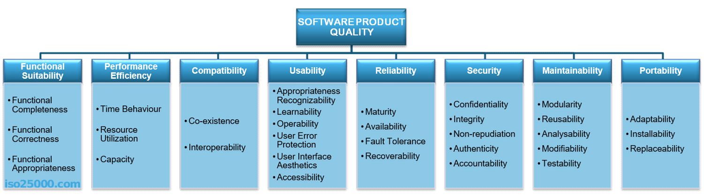
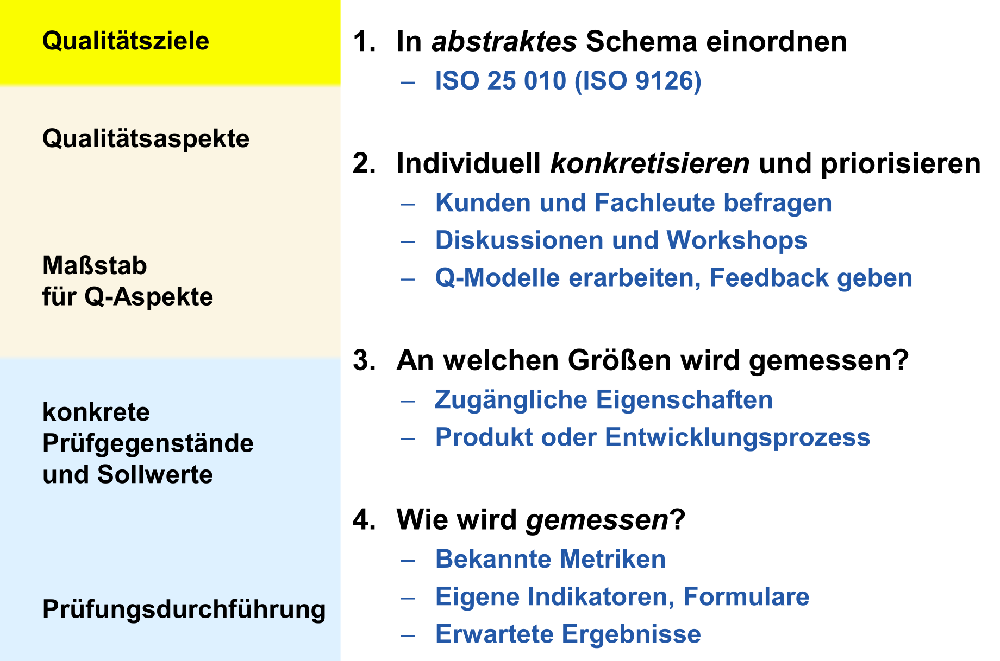
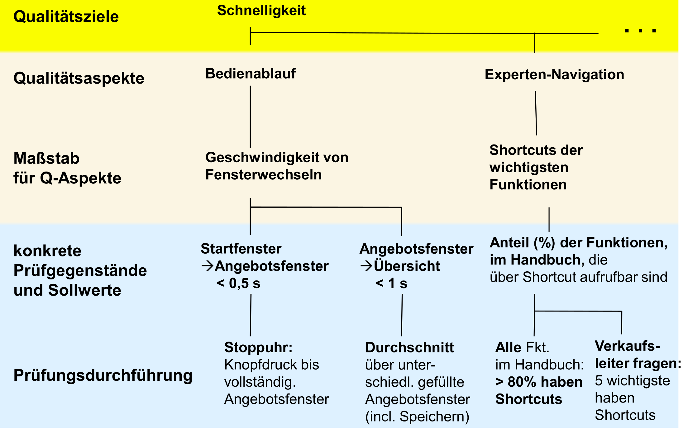

# ISO 9000
>Qualität ist die Gesamtheit von Merkmalen einer Einheit bezüglich ihrer Eignung, festgelegte und vorausgesetzte Erfordernisse zu erfüllen.

Einheit
: Produkt, Dienstleistung, Prozess, Organisation, **Software**

Vorausgesetzte Erfordernisse
: Schwierig! Woher soll man das wissen? Qualität ist damit nur in Bezug auf Ziele definiert.

## Definitionen
Qualitätsaspekt
: Eigenschaften einer Einheit, anhand derer ihre Qualität beschrieben und beurteilt wird.

Qualitätsziel
: Angestrebtes Qualitätsmerkmal (Beispiel: Mehr Wartbarkeit ist besser, egal wie man das misst)

Qualitätsanforderung
: Ein oder mehrere Qualitätsziele

Qualitätsmetrik
: Maß für Ausprägung eines Q-Aspekts

- ISO 25 010 ist die Referenz für die Vorlesung.
    - Damit kann man Elicitation beginnen.
    - ISO 9126 ist Vorgängernorm, sehr bekannt
- Auf dieser Basis entstehen Qualitätsmodelle muss man individuell mit Kunden erstellen (aushandeln)
- So entsteht eine baumartige Verfeinerungsstruktur. Spezifisch für ein Projekt angewendet, dadurch konkret, Möglichst noch objektiv messbar/bewertbar gemacht

# Allgemeine Qualitätsbegriffe (ISO 25 010)

**Klausurrelevant:**
- Acht Qualitätsaspekte oben
- Je zwei Unteraspekte

## Functional Suitability
>...degree to which a product or system provides functions that meet stated and implied needs when used under specified conditions.

Functional completeness
: functions cover all specified tasks and user objectives

Functional correctness
: provide correct results with the needed degree of precision.

Functional appropriateness
: functions facilitate the accomplishment of specified tasks and
objectives

## Performance efficiency
>...Performance relative to the amount of resources used under
stated conditions

Time behavior
: Degree to which the response and processing times and throughput rates of a product or system, when performing its functions, **meet requirements.**

Resource utilization
: Degree to which the amounts and types of resources used ... **meet requirements.**

Capacity
: Degree to which the maximum limits of a product or system parameter **meet requirements.**

## Compatibility
> Degree to which a product, system or component can exchange information with other products, systems or components, and/or perform its required functions while sharing the same hardware or software environment.

## Reliability
>Degree to which a system, product or component performs specified functions under specified conditions for a specified period of time.

## Maintainability
>This characteristic represents the degree of effectiveness and efficiency with which a product or system can be modified to improve it, correct it or adapt it to changes in environment, and in requirements

## Usability und Security

- siehe in den entsprechenden Kapiteln

# 3-Schritt-Schema für Q-Modelle

## Beispiel

# Maße und Metriken

Softwaremetrik
: Funktion, die eine Software-Einheit in einen Zahlenwert abbildet. Dieser Wert ist interpretierbar als der Erfüllungsgrad einer Qualitätseigenschaft der Software-Einheit. (Def nach IEEE Std. 1061)

