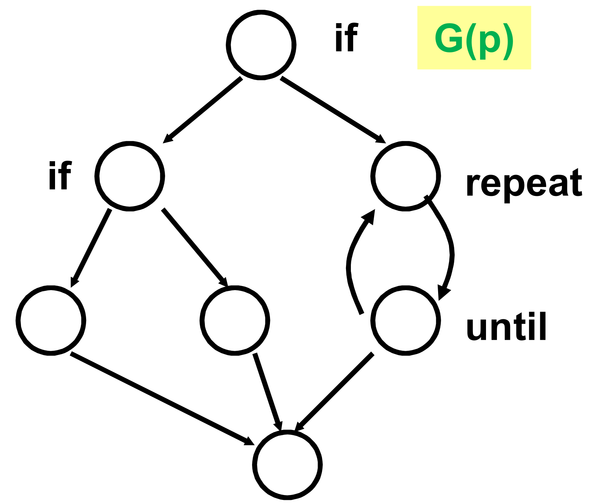

Die Idee der McCabe Metrik, ist dass der Programmablauf (Programmverzweigungen und Schleifen) das Programm komplex machen, nicht zwingend die LOC. Egal ob man durch Programmcode oder Ablaufgraph misst, sollten beide Techniken immer das gleiche Ergebnis liefern.

# Anweisung vs. Bedingung

Wichtig zu wissen, ist das ähnlicher Code je nach Kontext als Anweisung oder Bedingung zählt:

```
public static boolean test() {
    return ((1 == 1) && (2 == 2) || (1 == 5));
}
```
hat eine McCabe-Metrik von **1,** da ein Wert zurückgegeben wird.

```
public static boolean test(){
    return ((1 == 1) && (2 == 2) || (1 == 5)) ? true : false;
}
```
hat aber eine McCabe-Metrik von **4,** da die Ternäre Aussage erfordert, dass alle vorherigen Schritte evaluiert werden.

# Gemessen an Programmcode

Formel für Metrik \(m_c\), am Code \(c\) eines Prog. \(P\) gemessen

\[
m_c(p) := \# \text{IFs} + \# \text{LOOPs} + \# \text{CASEs} +1
\]

## Beispiel 1 (Vorlesung)

```
if z < 100
    if (z/4*sin(z) > x)
        then print z
        else print x
    else
        repeat
            x := x+10
        until z<x
    end
end
```

Hier sind zwei ifs, ein loop und kein case, also \(2+1+0+1 = 4\).

## Beispiel 2 (Übung)

```
public boolean isPrime(int number) {
    int root = (int) Math.sqrt(number) + 1;

    for (int i = 2; i < root; i++) {
        if (number % i == 0) {
            return false;
        }
    }

    return true;
}
```

Ein if, ein Loop, null Cases, also \(1+1+0+1 = 3\).

## Beispiel 3 (Übung)

```
public static int getTriangleKind(int sideA, int sideB, int sideC){
    if (sideA == sideB){
        return (sideB == sideC) ? 3 : 2;
    } else if (sideA == sideC || sideB == sideC){
        return 2;
    } else {
        return 1;
    }
}
```

**Achtung!** Hier ist ein weiteres verstecktes if-Statement. `sideB == sideC` wird konditionell ausgeführt, je nach dem Wert von `sideA == sideC`. Für weitere Informationen, auf den relevanten Graphen gucken.

Insgesamt hat man vier Ifs und null Schleifen bzw. Cases: \(4+0+0+1 = 5\).

# Gemessen an Struktur

Gegeben einen Programmablaufgraph \(G\) von \(p\): \[m_s(p) := e - n + 2\]

Wichtig: Bei einem Programmablaufplan nach DIN 66 001 werden aufeinander folgendene Knoten zusammengefasst (sie werden so oder so ausgeführt und ändern nichts an Verzweigungen, etc.)

## Beispiel 1 (Vorlesung)



Hier sind neun Kanten und sieben Knoten, also \(9-7+2=4\).

## Beispiel 2 (Übung)


Hier sind acht Kanten und sieben Knoten, also \(8-7+2 = 3\).

## Beispiel 3 (Übung)


Hier sieht man ganz klar das zweite if-Statement im `sideB == sideC`.

- Ohne Kürzen sind 13 Kanten und 10 Knoten enthalten: \(13-10+2=5\).
- Mit Kürzen sind 8 Kanten und 5 Knoten enthalten: \(8-5+2 = 5\).