# Gradfolgen

>Welche Folgen sind Gradfolgen eines Graphen?

>1. Die Folge \\((1,1,2,4,4)\\) ist **keine Gradfolge** eines Graphen.

Angenommen, \\(G\\) sei ein Graph mit Gradfolge \\((1, 1, 2, 4, 4)\\). Es gibt \\(5\\) Ecken, davon haben zwei Grad \\(4\\), sind also mit jeder anderen Ecke verbunden. Damit hat aber jede Ecke in \\(G\\) mindestens Grad \\(2\\).

>2. Die Folge \\((1,1,2,3,3)\\) ist **Gradfolge** eines Graphen.

Man kann diesen malen. Beispiel aus dem Quiz: 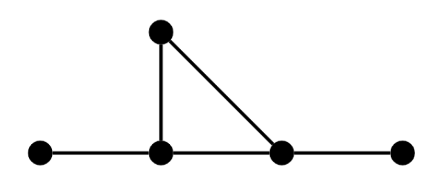

>3. Die Folge \\((1,2,2,3,3)\\) ist **keine Gradfolge** eines Graphen.

Nach **Satz 3.5(b)** muss die Anzahl der Ecken mit ungeradem Grad gerade sein. Hier hat man drei ungerade grade.

>4. Die Folge \\((1,1,1,1,2,2)\\) ist **Gradfolge** eines Graphen.

Diese Lösung war für mich kniffelig; ich habe die Möglichkeit eines Multigraphen nicht beachtet. Ein Graph mit Gradfolge (1, 1, 1, 1, 2, 2) ist 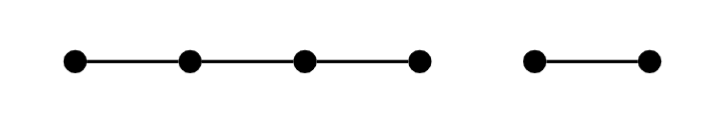

# Planare Graphen

>Entscheiden Sie jeweils, ob die folgenden Graphen planar sind.

>1. Der vollständige Graph \\(K_4\\)

Der Graph kann trivial "gebogen" werden um planar zu sein.

>2. Der Graph mit Adjazenzmatrix \\[
    \begin{pmatrix}
    0 & 1 & 1 & 1 & 1\\\
    1 & 0 & 1 & 0 & 1\\\
    1 & 1 & 0 & 1 & 1\\\
    1 & 0 & 1 & 0 & 1\\\
    1 & 1 & 1 & 1 & 0
    \end{pmatrix}
    \\]

Malt man diesen Graphen ist schnell zu erkennen, dass dieser planar ist: 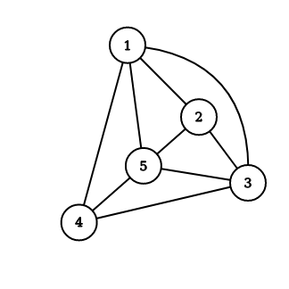

>3. Der Graph 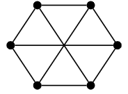

Dieser Graph ist nicht planar, da sich "innere" Kanten immer kreuzen werden, egal wie man sie biegt. 

>4. Der Graph 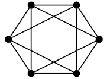

Dieser Graph ist planar. Man kann bei einem der inneren "Dreiecken" die Kanten nach außen "biegen".

# Eulersche Graphen

> Entscheiden Sie jeweils, ob die Graphen eulersch sind oder nicht.

>1. 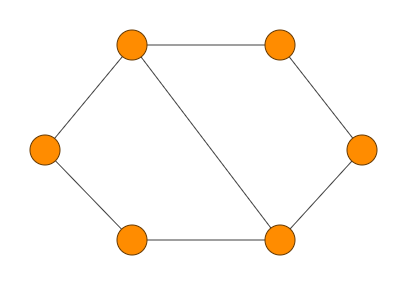

Es gibt Wege die jede Kante enthalten, jedoch sind diese nach **Definition 3.7** des Skriptes entweder nicht geschlossen oder nicht einfach.

>2. 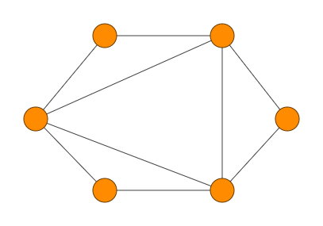

Der Graph ist Eulersch, ein Weg wäre wie folgt: 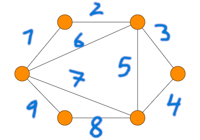

>3. 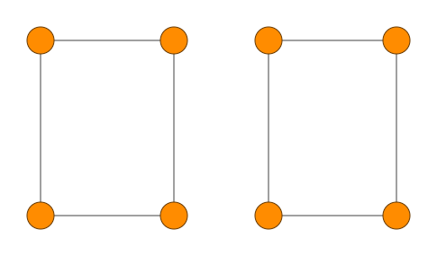

Obwohl alle Ecken nach Proposition 3.8. einen geraden Grad haben, ist der Graph eindeutig **nicht eulersch,** da er nicht zusammenhängend ist (**Bemerkung 3.9.**)

>4. 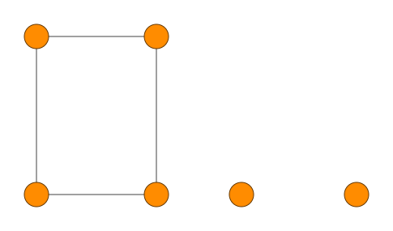

Dieser Graph ist zwar nicht zusammenhängend, aber trotzdem ist er eulersch, da der linke Teil einen Weg mit **allen** kanten enthält.

# Adjazenzmatrix und Wege

>Bestimmen Sie die Adjazenzmatrix \\(A\\) des folgenden Graphen. 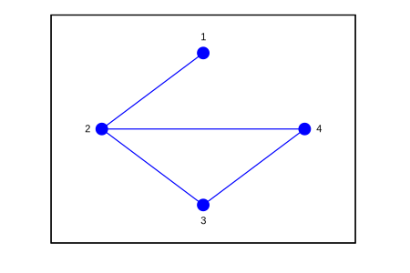

Die Adjazenzmatrix kann bestimmt werden, indem man für jeden Knoten (Zeile) einträgt, ob er mit einem anderen Knoten (Spalte der Zeile) verbunden ist. Bei ungerichteten, unbewichteten Graphen ist die Adjazenzmatrix immer symmetrisch und besteht nur aus \\(1\\)en und \\(0\\)en:

\\[
    A = \begin{pmatrix}
    0 & 1 & 0 & 0\\\
    1 & 0 & 1 & 1\\\
    0 & 1 & 0 & 1\\\
    0 & 1 & 1 & 0
    \end{pmatrix}
\\]

>Bestimmen Sie die Anzahl der Wege der Länge \\(4\\) mit Endpunkt \\(2\\) in dem Graphen.

Nach **Satz 3.18** müssen wir also \\(A^4\\) berechnen. **Achtung:** einer meiner Fehler war es, "faul" zu sein, und \\((A^2)^2\\) zu rechnen. Tatsächlich müssen die Matrizen aber alle drei mal mühsam[^effort] ausmultipliziert werden:
\\[
    \begin{aligned}
    A^2 &=
    \begin{pmatrix}
    0 & 1 & 0 & 0\\\
    1 & 0 & 1 & 1\\\
    0 & 1 & 0 & 1\\\
    0 & 1 & 1 & 0
    \end{pmatrix}
    \begin{pmatrix}
    0 & 1 & 0 & 0\\\
    1 & 0 & 1 & 1\\\
    0 & 1 & 0 & 1\\\
    0 & 1 & 1 & 0
    \end{pmatrix}
    =
    \begin{pmatrix}
    1 & 0 & 1 & 1\\\
    0 & 3 & 1 & 1\\\
    1 & 1 & 2 & 1\\\
    1 & 1 & 1 & 2
    \end{pmatrix}\\\
    A^3 &=
    \begin{pmatrix}
    1 & 0 & 1 & 1\\\
    0 & 3 & 1 & 1\\\
    1 & 1 & 2 & 1\\\
    1 & 1 & 1 & 2
    \end{pmatrix}
    \begin{pmatrix}
    0 & 1 & 0 & 0\\\
    1 & 0 & 1 & 1\\\
    0 & 1 & 0 & 1\\\
    0 & 1 & 1 & 0
    \end{pmatrix}
    =
    \begin{pmatrix}
    0 & 3 & 1 & 1\\\
    3 & 2 & 4 & 4\\\
    1 & 4 & 2 & 3\\\
    1 & 4 & 3 & 2
    \end{pmatrix}\\\
    A^4 &=
    \begin{pmatrix}
    0 & 3 & 1 & 1\\\
    3 & 2 & 4 & 4\\\
    1 & 4 & 2 & 3\\\
    1 & 4 & 3 & 2
    \end{pmatrix}
    \begin{pmatrix}
    0 & 1 & 0 & 0\\\
    1 & 0 & 1 & 1\\\
    0 & 1 & 0 & 1\\\
    0 & 1 & 1 & 0
    \end{pmatrix}
    =
    \begin{pmatrix}
    3 & 2 & 4 & 4\\\
    2 & 11 & 6 & 6\\\
    4 & 6 & 7 & 6\\\
    4 & 6 & 6 & 7
    \end{pmatrix}
    \end{aligned}
\\]

Da bei "allen Wegen" der Startpunkt egal ist, summieren wie hier die gesamte zweite Spalte: \\[\sum_n (A^4)_{n,2} = 2+11+6+6 = 25.\\]

[^effort]: Ja, ich habe diese beim Lernen händisch ausmultipliziert und dann nochmal schick in LaTeX geschrieben. So verinnerliche ich auf meiner eigenen komischen Art das Material --- und die Übung tut gut.

# Grundlegende Begriffe zu Graphen

>Ordnen Sie jedem Fachbegriff auf der linken Seite die richtige Definition von der rechten Seite zu.

## \\(k\\)-regulär
>Ein Graph heißt ..., wenn alle Ecken Grad \\(k\\) haben.

## eulersch
>Ein Graph heißt ..., wenn es einen geschlossenen Weg gibt, der alle Kanten genau einmal enthält.

## zusammenhängend
>Ein Graph heißt ..., wenn es für zwei beliebige Ecken \\(u,v\\) einen Weg mit Anfangspunkt \\(u\\) und Endpunkt \\(v\\) gibt.

## hamiltonsch
>Ein Graph heißt ..., wenn es einen geschlossenen, einfachen und eckeneinfachen Weg gibt, der jede Ecke enthält.

## planar
>Ein zusammenhängender Graph heißt ..., wenn er sich in der Ebene so zeichnen lässt, dass keine Kanten sich kreuzen.

## Grad
>Der ... einer Ecke in einem Graphen ist die Anzahl der anhängenden Kanten.

## Graph
>Ein ... ist ein Paar \\((E,K)\\) mit einer endlichen Menge \\(E \ne \empty\\) und einer Teilmenge \\(K \subseteq (E \times E) \setminus \\{(a,a) \mid a \in E\\\}\\).

## Baum
>Ein zusammenhängender Graph heißt ..., wenn es keinen Kreis mit positiver Länge gibt.

## Multigraph
>Ein ... besteht aus einer endlichen Eckenmenge \\(E\\) und einer endlichen Kantenmenge \\(K\\), wobei Schleifen und Mehrfachkanten zwischen Ecken zugelassen sind.

# Prüfer-Code

> Bestimmen Sie den Prüfer-Code des folgenden Baums. 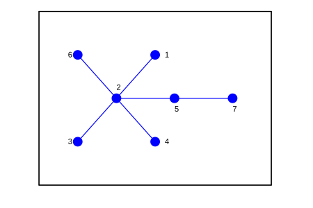

Bei einem *Prüfer-Code* wird der baum sukzessiv "entblättert," wobei man das kleinste Blatt und seine Kante streicht und dessen Nachbarn notiert. Streicht man in dem obigen Baum die Blätter 1, 3, 4, 6, 7 erhält man \\[[2, 2, 2, 2, 5]\\] als Code. Hierbei werden die zwei letzten Blätter ausgelassen (es ist bereits impliziert, dass die 2 und 5 über eine Kante verbunden sein müssen).

# Aussagen zu einem Graphen

>Welche Aussagen sind wahr für den folgenden Graph? 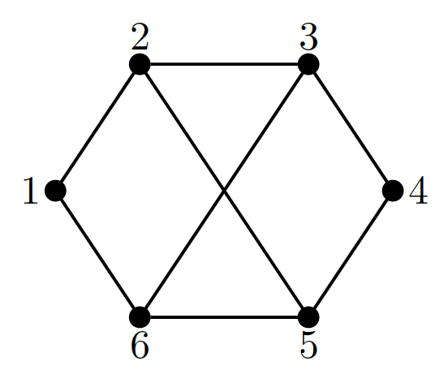

>1.  Der Graph ist planar.

**Wahr.** Man kann eine der "inneren" Kanten nach "außen" biegen.

>2. Die Gradfolge des Graphen ist \\((2,2,3,3,3,3)\\)

**Falsch.** Die Zahlen der Folge stimmen, aber die Reihenfolge ist falsch.

>3. Der Graph ist 3-regulär.

**Falsch.** Man sieht, dass zwei der sechs Ecken den Grad 2 haben. 3-regulär bedeutet aber, dass *alle* Kanten den Grad 3 haben.

>4. Der Graph ist zusammenhängend.

**Wahr.** Es gibt von jeder Kante einen Weg zu jeder anderen Kante.

# Aussagen zu Wegen in einem Graphen

>Gegeben sei der folgende Graph \\(G.\\) 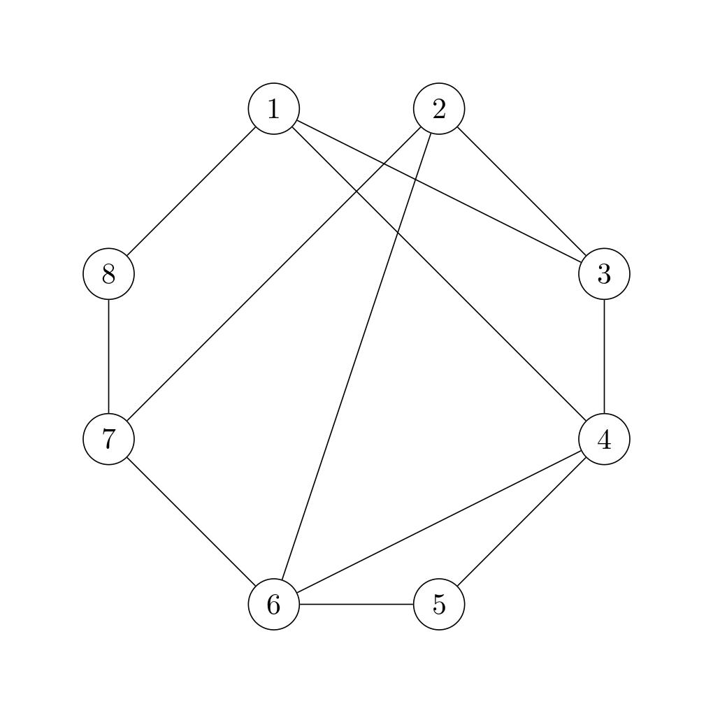
>
>Entscheiden Sie, welche dieser Aussagen für die folgenden Wege wahr sind und welche falsch.

Hier nutzt man **Definition 3.3** des Skriptes. **Achtung:** obwohl die Begriffe eigentlich selbsterklärend sind, habe ich "einfach" und "eckeneinfach" durcheinander --- Übungssache.

>1. Der Weg \\((1,8,7,2,6,5,4,3,1)\\) ist geschlossen.

**Wahr.** Der Anfangsknoten des Weges ist auch der Endknoten.

>2. Der Weg \\((1,8,7,2,6,5,4,3,1)\\) enthält jede Ecke.

**Wahr.**

>3. Der Weg \\((1,8,7,6,5,4,3,2,6,4,1)\\) ist eckeneinfach.

**Falsch.** Man besucht die Ecken 4 und 6 zwei mal.

>4. Der Weg \\((1,8,7,2,6,5,4,3,1)\\) ist einfach.

**Wahr.** Alle Kanten sind paarweise verschieden.

# Gradfolge bestimmen

>Bestimmen Sie die Gradfolge des folgenden Graphen. 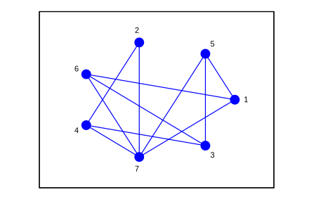

Fügt man von jedem Knoten (geeordnet) den Grad zu einer Liste, erhält man \\[[3, 2, 3, 3, 3, 3, 5].\\]

# Graph ohne Hamilton-Kreis

>Wir wollen für den folgenden Graph per Widerspruch zeigen, dass es keinen Hamilton-Kreis in diesem Graph geben kann. Vervollständigen Sie dazu die folgenden Sätze mithilfe der gegebenen Auswahlmöglichkeiten derart, dass wahre Aussagen und ein sinnvoller Textzusammenhang entstehen.
>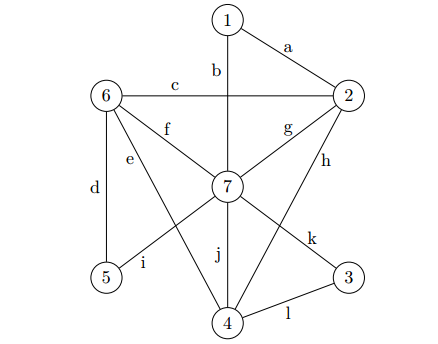
>Hinweis: Bei dieser Aufgabe ist es wichtig, dass Sie den schrittweisen Aufbau des vermeintlichen Hamilton-Kreises selbst nachvollziehen und dementsprechend skizzieren.

Wir versuchen einen Hamilton-Kreis \\(H\\) zu konstruieren.

Es gilt, dass ein Hamilton-Kreis für jede Ecke genau zwei anhängende Kanten enthält. Wir suchen daher die Ecke im Graphen mit minimalem Grad. Gibt es mehrere Ecken diesen Grads, so wählen wir etwa die Ecke mit kleinster Nummer. In diesem Graph ist **1** diese Ecke. Sie hat Grad 2 und somit liegen die Kanten **a und b** in \\(H\\).

Wir fahren fort und suchen nach weiteren Ecken vom Grad 2. Die Ecke 3 hat ebenfalls Grad 2. Somit liegen die Kanten k und l in \\(H\\).

Ebenso hat die Ecke **5** den Grad 2, wodurch auch **d und i** in \\(H\\) liegen.

An dieser Stelle haben wir bereits einen Widerspruch, da wir gezeigt haben, dass drei an die Ecke **7** anhängende Kanten in \\(H\\) liegen müssten. Somit gibt es keinen Hamilton-Kreis in diesem Graphen.

>Hinweis zur Lösung: Bei der (vermeintlichen) Konstruktion eines Hamilton-Kreises verfahren wir hier nach dem Prinzip des Backtracking. Per trial and error versuchen wir, den bereits konstruierten Weg zu einem Hamilton-Kreis auszubauen. Ist klar, dass sich ein bereits konstruierter Weg nicht zu einem Hamilton-Kreis ergänzen lässt, wird der letzte Schritt oder die letzten Schritte zurückgenommen und ein alternativer Weg gesucht. Auf diese Weise finden wir entweder einen Hamilton-Kreis oder können die Existenz eines solchen definitiv ausschließen.